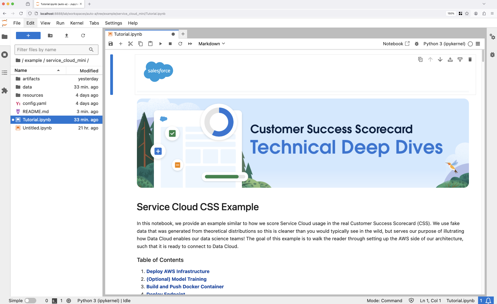

<p>
  
  
</p>

# Service Cloud CSS Example

This is the AWS portion of our tutorial _Build Your Own Customer Success Scorecard with SageMaker and Data Cloud_. Below we will provide details on how to set up your environment such that you can deploy AWS resources that will pair with Data Cloud. We use [Jupyter](https://jupyter.org/), a common tool for data science development, which it is perfect to interactively execute code and verify its successful execution.

### Install Python

<p style="color: lightgrey;"><em>Skip if you already have Python 3.10 installed!.</em></p>

This project requires Python 3.10 or newer.  Head over to the [Python website](https://www.python.org/downloads/), grab the latest version and install the package.  After installation, you can verify your python version by running this command from a terminal:

```bash
python --version
```

### Clone the project

Next we can clone this project to your local machine.  Open a terminal and run these commands:

```bash
git clone https://git.soma.salesforce.com/da-mle/css-external.git # TODO: UPDATE THIS URL
cd css-external
```

### Create Virtual Environment

To avoid installing packages to your global Python environment, we will create a [Virtual Environment](https://docs.python.org/3/library/venv.html) in the project directory.  From the same terminal you used to clone the project:

```bash
# Create the virtual environment
python -m venv .venv
# Activate
source .venv/bin/activate
```

Once the virtual environment is activated, you will notice `(.venv) ` has been added as a prefix to your terminal prompt.

### Install Jupyter

Now we can install Jupyter Lab by running:

```bash
python -m pip install jupyter
```

### Start Jupyter Lab and Open Our Tutorial

Finally, we can launch our Jupyter Lab environment by running:

```bash
jupyter lab
```

This will automatically open a new tab in your default browser and connect to the Jupyter server.  Using the directory browser on the left hand side, navigate to `example -> service_cloud_mini` then open the notebook `Tutorial.ipynb`.

You will see something like this:


